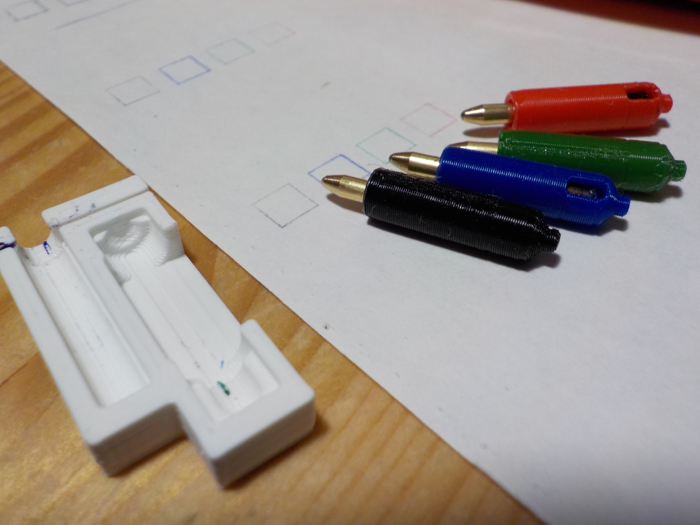

# ALPS plotter pen replacements kit (soon with CAD files)

3D-printable holder and cutting kit to replace ALPS plotter pens, which are becoming rare and expensive. These allow using cheap *Bic 4-colors* ball-pens instead. For use in MCP-40 (ORIC, Sega/Yeno…) and other similar printers.

It seems some people already tried previously, but [the only attempt I found](https://www.thingiverse.com/thing:7412) was not functionnal. So I designed a complete one, and after several iterations we should soon have a usable alternative to overpriced *New Old Stock* pens.

Designed in OpenSCAD.

License isn't chosen yet.

## User manual

The user manual is available in [English](manual_en.md) ([PDF](manual_en.pdf)), [French](manual_fr.md) ([PDF](manual_fr.pdf)).

## Oredering pre-made kits

**TODO:**

Since the required precision is similar to that of regular 3D printers and may need several tries, you may want to order calibrated pieces instead.

## OpenSCAD files (Real Soon Now™)

**TODO: publish them**

- [alps_plotter_pen.scad](alps_plotter_pen.scad): The pen holder itself, where the ink tube is fitted.
- [alps_plotter_pen_cutting_jig.scad](alps_plotter_pen_cutting_jig.scad): A small tool to help with cutting the ink tube to the exact length and  verify the assembly size.

## TODO

- [ ] test with SLA printing
- [ ] choose licence
- [ ] publish CAD files proper here
- [ ] publish on Thingiverse
