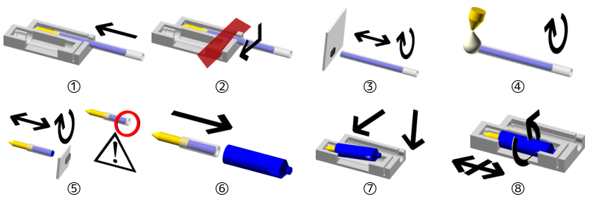

# Description

This 3D-printed kit allows using *Bic® 4-colors* pens or recharges as stylus for ALPS-based printers like the MCP-40.

It compries four color holders, two extra holders (in case one breaks, or for other colors), a cutting jig, a bent paperclip to help extract the ink tube from the holder.

# Usage

## Prerequisites

- cutter or exoknife or other sharp blade
- hot-glue gun to seal the remainder of the ink tube
- gloves or a good soap for the ink spills
- paper tissues or wipes

## Extracting empty ink tube from the holder

When the installed ink tube is empty, use the bent paperclip as a lever into the side hole to push the ink tube outwards.

*Note: It is possible to use pliers on the metallic part, but you risk separating it from the ink tube and spilling a lot of ink.*

## Scavenging ink tubes from a complete 4-colors pen

Unscrew the bottom part (usually blue), and pull on the transparent ink tubes to detach them from the top of the pen.

## Setup from complete ink tube

①&nbsp;Insert the ink tube by the side hole on the cutting jig, ball first. The ball must touch the other end of the gutter. ②&nbsp;Using a sharp blade, cut the ink tube at the slit.

*Note: The slit being larger than the required precision for the assembly (1mm), it is advised to do the first attempts aligning your blade on the exterior side on the slit, and extract the ink tube and re-cut it if too long. If the ink tube is cut too short, it risks going too far into the holder regardless the friction, and not print at all, and result in a too short stylus. But if the assembly is too long, it risks blocking the mechanism and damaging the printer.*

③&nbsp;Remove the protruding part of the tube, wipe off the ink from the border of the tube. ④&nbsp;Now seal the cut end of the tube with the hot glue gun, only this side. A pearl-sized drop is enough, it is only required to have an air-tight seal. Do not seal the other end of the tube, doing so would risk leaking the ink from the other side.

⑤&nbsp;Remove the useful part from the cutting jig, the tube part with the ball end, and wipe off enough ink from the border of the tube so it doesn't leak, about a millimeter, and wipe the sides of the tube as well.

⑥&nbsp;Progressively push the cleaned tube inside the holder, the ball point on the outside. ⑦&nbsp;When the total length of the assembly approaches the size of the test spot on the cutting jig, put it inside, with the ball first, and push again to adjust it, until it fits correctly. ⑧&nbsp;It must be able to turn around inside, but not move along the axis. If it doesn't fit, remove the ink tube from the holder (see above), and retry assembly after cutting the tube shorter.

## Refill from cut ink tube leftover

(**untested**) It is possible to reuse the ball assembly and the rest of the unused ink tube for refill several times.

Remove the metallic part from the empty tube after disassembly.

Carefully remove the hot glue cap from the unused ink tube, and if needed trim the end to have the ink right at the end of it.

Fit the metallic part at the end of the tube, and wipe off the excess ink around it.

Then proceed to setup as with a complete ink tube.

